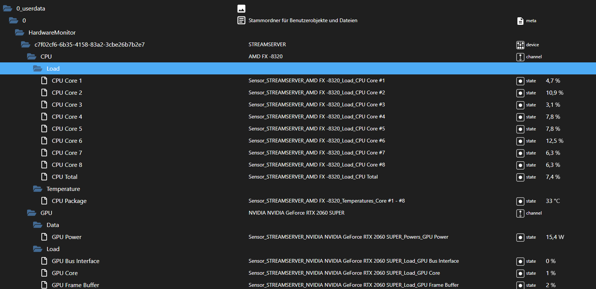

## Monitoring Service
Dieser Service bietet die Funktion Daten aus [Open Hardware Monitor](https://openhardwaremonitor.org/) auszulesen und in einer Übersicht anzuzeigen.

  * [Funktionsweise](#funktionsweise)
    + [Swagger](#swagger)
  * [Voraussetzungen](#voraussetzungen)
  * [Installation](#installation)
  * [Konfiguration](#konfiguration)
    + [Umgebungsvariablen](#umgebungsvariablen)
  * [Server konfigurieren](#server-konfigurieren)
  * [Service Oberfläche und IoBroker](#service-oberfl-che-und-iobroker)
  * [IoBroker](#iobroker)
  * [Docker](#docker)
  * [ToDo](#todo)
  * [Hinweise](#hinweise)

### Funktionsweise
Die Daten werden periodisch aus der Ferne über den "Remote Web Server" von Open Hardware Monitor abgefragt.
Über eine [Razor](https://docs.microsoft.com/de-de/aspnet/core/razor-pages/?view=aspnetcore-6.0&tabs=visual-studio) Webseite werden die Daten für die konfigurierten Server angezeigt.
Der Service stellt ebenfalls eine [SignalR](https://docs.microsoft.com/de-de/aspnet/signalr/overview/getting-started/introduction-to-signalr) Schnittstelle bereit, welche die Seite verwendet um die Werte periodisch zu aktualisieren.
Die Schnittstelle informiert auch über Änderungen an den Servereigenschaften.

Optional können die Daten an [IoBroker](https://www.iobroker.net/) gesendet werden. Dafür ist der Adapter [simple-api](https://github.com/ioBroker/ioBroker.rest-api/blob/master/README.md) notwendig.
 #### Swagger
 Unter dem dem Endpunkt http://{Ip}:{Port}/swagger (http://localhost:5000/swagger) ist die API Dokumentation des Service, kann somit auch optional anderweitig verwendet werden.
 
### Voraussetzungen
Um diesen Service zu verwenden werden folgende Komponenten benötigt

 -  **Server** oder **Computer** auf dem Open Hardware Monitor läuft und der "Remote Web Server" aktiviert ist
 - Die **Ip Adresse** des Servers/Computers
 - [PostgreSQL](https://www.postgresql.org/) -> Speichern der Server und Konfiguration
- [ASP .NET Core Runtime 3.1.27 ](https://dotnet.microsoft.com/en-us/download/dotnet/3.1):
	 - [Windows](https://dotnet.microsoft.com/en-us/download/dotnet/thank-you/runtime-aspnetcore-3.1.27-windows-x64-binaries)
	 - [Linux](https://docs.microsoft.com/de-de/dotnet/core/install/linux?WT.mc_id=dotnet-35129-website)
	 - [macOS](https://dotnet.microsoft.com/en-us/download/dotnet/thank-you/runtime-aspnetcore-3.1.27-macos-x64-binaries)
 
 Optional für IoBroker:
 
 - IoBroker Instanz
 - Adapter [simple-api](https://github.com/ioBroker/ioBroker.rest-api/blob/master/README.md)

Der Service kann ebenfalls in [Docker](https://www.docker.com/) verwendet werden, mehr dazu [hier](#docker)

### Installation
Der Service wurde Hauptsächlich für die Verwendung in Docker entwickelt. Dennoch kann der Service nativ unter Windows, Linux, MacOS und [IIS](https://www.iis.net/) Service betrieben werden.

Dafür kann die neuste Version unter "Releases" runtergeladen werden. Sind die [Voraussetzungen](#voraussetzungen) erfüllt und die [Konfiguration](#konfiguration) korrekt, kann der Service mit der Betriebssystemabhängigen ausführbaren Datei gestartet werden.
(**Windows**: MTJR.HardwareMonitor.exe, **Linux**: MTJR.HardwareMonitor, **macOS**: MTJR.HardwareMonitor.app).
Für [IIS](https://www.iis.net/) bitte folgende [Anleitung](https://jakeydocs.readthedocs.io/en/latest/publishing/iis.html) für das Bereitstellen verfolgen.

### Konfiguration
Die Konfiguration des Service selber erfolgt über die "appsettings.json" bzw. "appsettings.production.json".

Hier wird die Verbindung zu PostgreSQL eingetragen. Die "appsettings.json" enthält zunächst die Konfiguration für das Logging.
Die "appsettings.production.json" wird verwendet wenn auch die Umgebungsvariable
"ASPNETCORE_ENVIRONMENT=Production" gesetzt ist.
Die Konfiguration sollte folgendes enthalten:
```
{
  "HardwareMonitorConfiguration": {
    "DatabaseConnectionString": "Server={ServerIP oder Hostname};Port={Postgres Port (5432)};Database={Datenbankname};User Id={Benutzername};Password={Passwort}"
}
```
**Wichtig** Der Datenbank muss auf der Datenbank das Recht haben Tabellen anzulegen.

#### Umgebungsvariablen
Der Port kann über die Umgebungsvariable
**ASPNETCORE_URLS=http://*:5000**
konfiguriert werden, wobei Port 5000 Standard ist.

PostgreSQL kann statt in der Konfigurationsdatei auch über die Umgebungsvariable
**HardwareMonitorConfiguration__DatabaseConnectionString=Server={ServerIP oder Hostname};Port={Postgres Port (5432)};Database={Datenbankname};User Id={Benutzername};Password={Passwort}**
konfiguriert werden.

Der Service ist damit startbereit.

### Server konfigurieren
Über die Seite des Service unter http://{Ip}:{Port} (http://localhost:5000) ist zunächst eine leere Liste zu sehen. Klickt man nun auf das `+` wird die Eingabemaske für einen Server angezeigt.


Um den Server zu bearbeiten kann in der Liste auf den Namen geklickt werden.

### Service Oberfläche und IoBroker
Klickt man oben links auf das Zahnrad kommt man zu Oberflächen- und IoBroker-Einstellungen.
Hier wird ebenfalls eine Liste der Verbundenen Clients angezeigt.
Die Einstellungen sollten alle selbsterklärend sein.


### IoBroker
Ist in den Einstellungen "Daten an IoBroker senden" aktiv, werden die Daten aus Open Hardware Monitor an IoBroker gesendet, wobei dies über den Adapter rest-api geschieht.
Alle Zustände befinden sich unter `0_userdata.0.HardwareMonitor`



### Docker
Das Repo enhält eine Dockerfile, das Docker Image kann [hier](https://hub.docker.com/r/mtjr/hardwaremonitor) runtergeladen werden.
Zum starten folgendes Kommando ausführen:
```
docker run -d --name HardwareMonitor -p 5000:5000 -e HardwareMonitorConfiguration__DatabaseConnectionString=Server={ServerIP oder Hostname};Port={Postgres Port (5432)};Database={Datenbankname};User Id={Benutzername};Password={Passwort} mtjr/hardwaremonitor
```
~~Zusätlich beinhaltet das Repo eine Docker Compose Datei welche, mit dem Befehl~~
```
docker compose up -d 
```
~~den Service sowie PostgreSQL startet~~

**In Arbeit**


### ToDo
- Docker Compose
- Im Moment werden nur GPU Daten von NVIDIA Grafikkarten ausgelesen, in Zukunft sollen alle unterstützt werden
- Bei mehr als einer Grafikkarte wird in IoBroker nur eine angezeigt. Dies wird in Zukunft optional als JSON Tabelle in IoBroker angelegt

### Hinweise
- Der Intervall für einen Server kann Minimum 1 Sekunde sein, hierbei verbraucht der Service jedoch einiges an Ressourcen **you've been warned**
- Die Daten der Festplatten wird als JSON Tabelle in IoBroker abgelegt, da hier mehrfache möglich sind. (Für meinen Anwendungsfall alle in VIS bzw. Jarvis darzustellen besser)
- Warum nicht als IoBroker Adapter? 
Diesen Service kann man unabhängig von IoBroker und Open Hardware Monitor bereitstellen, da nicht jeder die Verbindung zu IoBroker benötigt.
Auch verbraucht das auslesen der Daten und speichern in IoBroker recht viele Ressourcen, frisst also nicht die von IoBroker.
Der Service wurde in erster Linie nur als Überwachungstool für Server/ Computer konzipiert,
die Anbindung an IoBroker kam später