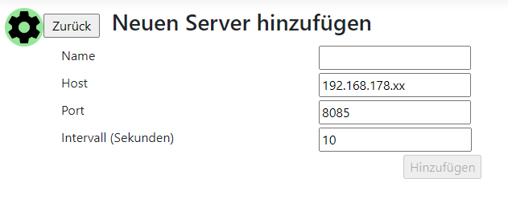
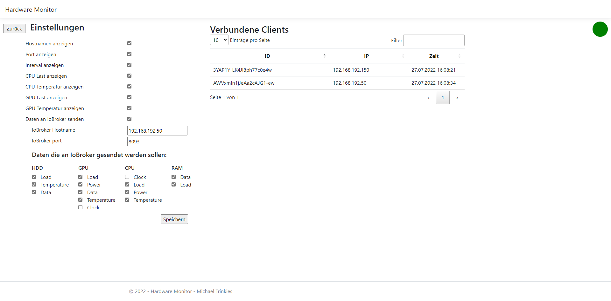
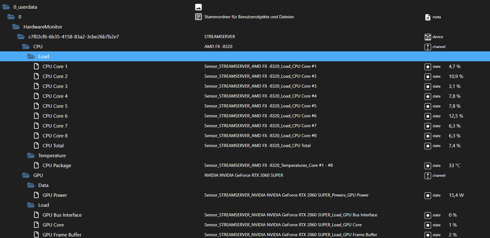

## Montoring Service
Für Deutsche Version, siehe [hier](https://github.com/MTrinkiesJr/MTJR.HardwareMonitor/blob/master/readme.md)

| | |
|--|--|
Service | [](https://dev.azure.com/mtrinkies/MTJR/_build/latest?definitionId=57&branchName=master)|
Docker| [](https://dev.azure.com/mtrinkies/MTJR/_build/latest?definitionId=59&branchName=master)|

This Service reads data from [Open Hardware Monitor](https://openhardwaremonitor.org/) and displays it in a web overview

* [Functionality](#functionality)
* [Swagger](#swagger)
* [Requirements](#requirements)
* [Installation](#installation)
* [Configuration](#configuration)
* [Environment variables](#environment-variables)
* [Configure server](#configure-server)
* [Site settings and IoBroker](#site-settings-and-iobroker)
* [IoBroker](#iobroker)
* [Docker](#docker)
* [ToDo](#todo)
* [Hints](#hints)

### Functionality

The data will be fetched remotely from the "Remote Web Server" from Open Hardware Monitor
A [Razor](https://docs.microsoft.com/de-de/aspnet/core/razor-pages/?view=aspnetcore-6.0&tabs=visual-studio) Page will display the configured server. There is also a [SignalR](https://docs.microsoft.com/de-de/aspnet/signalr/overview/getting-started/introduction-to-signalr) interface to automatically refresh the values.
The interface will inform about device updates.

Optionally you can send the data to [IoBroker](https://www.iobroker.net/), which requires the [simple-api](https://github.com/ioBroker/ioBroker.rest-api/blob/master/README.md) adapter.

### Swagger

The endpoint http://{Ip}:{Port}/swagger (http://localhost:5000/swagger) serves the API documentation, which may be used for other things.

### Requirements

To run this service following requirements must be met

- Open Hardware Monitor is running on your **computer** or **server**
- [PostgreSQL](https://www.postgresql.org/) -> Hold the server and the configuration
- [ASP .NET Core Runtime 3.1.27 ](https://dotnet.microsoft.com/en-us/download/dotnet/3.1):
	 - [Windows](https://dotnet.microsoft.com/en-us/download/dotnet/thank-you/runtime-aspnetcore-3.1.27-windows-x64-binaries)
	 - [Linux](https://docs.microsoft.com/de-de/dotnet/core/install/linux?WT.mc_id=dotnet-35129-website)
	 - [macOS](https://dotnet.microsoft.com/en-us/download/dotnet/thank-you/runtime-aspnetcore-3.1.27-macos-x64-binaries)

Optional for IoBroker

- Running IoBroker instance
- Adapter [simple-api](https://github.com/ioBroker/ioBroker.rest-api/blob/master/README.md)

The Service may also be used with Docker, see [hier](#docker)

### Installation

The service is developed to run in docker. But it also works in Windows, Linux, MacOS and as [IIS](https://www.iis.net/) service.

The newest version can be downloaded under 'Releases'. If the [Voraussetzungen](#voraussetzungen) met and the [Konfiguration](#konfiguration) is correct it can be startet by the operating system dependent  executable (**Windows**: MTJR.HardwareMonitor.exe, **Linux**: MTJR.HardwareMonitor, **macOS**: MTJR.HardwareMonitor.app).

For an [IIS](https://www.iis.net/) deployment follow this [Instructions](https://jakeydocs.readthedocs.io/en/latest/publishing/iis.html) 

### Configuration

The configuration is applied by "appsettings.json" or "appsettings.production.json".

The configuration holds the parameters to connect to PostgreSQL, the configuration contains only the logging configuration as default.

The "appsettings.production.json" only will be used when the environment variable 
"ASPNETCORE_ENVIRONMENT=Production" is set.


The configuration should contain:
```
{
  "HardwareMonitorConfiguration": {
    "DatabaseConnectionString": "Server={ServerIP or Hostname};Port={PostgresPort (5432)};Database={DatabaseName};User Id={Username};Password={Password}"
}
```

**Attention** The configured user should have the permissions to create tables

### Environment variables

The port ist set by
**ASPNETCORE_URLS=http://*:5000**
where 5000 is default

PostgreSQL can be set by
**HardwareMonitorConfiguration__DatabaseConnectionString=Server={ServerIP or Hostname};Port={Postgres Port (5432)};Database={DatabaseName};User Id={Username};Password={Password}**

The service is then ready to start.

### Configure server

Open the web site under http://{Ip}:{Port} (http://localhost:5000), which dislays a empty list. Press on '+' which shows a input mask for a server.



To edit a server click on the name in the list

### Site settings and IoBroker

When you click on the gear in the upper left corner, the settings for the site and IoBroker will appear. The settings should all be self-explanatory.



### IoBroker

Is the setting "Daten an IoBroker senden" active, the data will be send to IoBroker through the rest-api adapter.

All objects will be under `0_userdata.0.HardwareMonitor`



### Docker
The repo contains a Dockerfile, the image can be downloaded [here](https://hub.docker.com/r/mtjr/hardwaremonitor).

To star execute following command: 
Zum starten folgendes Kommando ausführen:
```
docker run -d --name HardwareMonitor -p 5000:5000 -e HardwareMonitorConfiguration__DatabaseConnectionString=Server={ServerIP oder Hostname};Port={Postgres Port (5432)};Database={Datenbankname};User Id={Benutzername};Password={Passwort} mtjr/hardwaremonitor
```

Additionally the repo contains a docker compose file:
```
version: '2'
services:
  postgres:
    image: postgres:12.4
    hostname: postgres
    container_name: postgres
    ports:
      - 5432:5432
    restart: always
    environment:
      POSTGRES_PASSWORD: hardwaremonitor
      POSTGRES_USER: admin
    volumes:
      - postgres:/var/lib/postgresql/data

  hardwaremonitor:
    container_name: hardwaremonitor
    hostname: hardwaremonitor
    image: mtjr/hardwaremonitor
    restart: always
    ports:
      - "5000:5000"
    links:
      - postgres
    environment: 
      - ASPNETCORE_URLS=http://*:5000     
      - HardwareMonitorConfiguration__DatabaseConnectionString=Server=postgres;Port=5432;Database=hardwaremonitor;User Id=admin;Password=hardwaremonitor 

volumes:
  postgres:      
```

which can by started by:

```
docker compose up -d 
```
which start PostgreSQL and the service

### ToDo
- Only data from NVIDIA GPUs supported at the moment

### Hints
- The interval for a server must be at minimum 1 second, but it uses more resources **you've been warned**
- The data for disks will be send as a JSON table, because multiple may be in your system. (And it's mor applicable to display data in Jarvis or VIS)
- Why not as IoBroker adapter
This service can be deployed independently from IoBroker and Open Hardware Monitor, because not everyone needs IoBroker.
Also the reading and parsing the data consumes a lot of resources, which saves a lot in Iobroker
The service was designed as monitoring tool for server/ computer in the first place, the IoBroker connection came later.